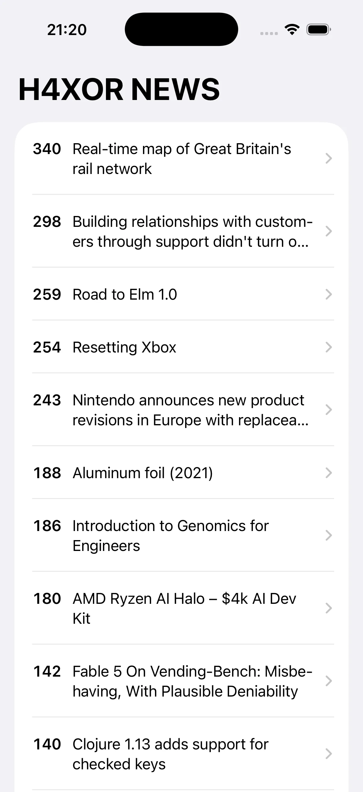

# H4XOR News 📰

An iOS reader for the Hacker News front page.
Shows the top stories with their points, opens each article in an in-app browser, and refreshes on pull.

<p align="center">
  
</p>

---

## 🧭 Features

* Front-page stories fetched from the Hacker News (Algolia) API
* Points, title, and tap-through to the full article
* In-app web view with back-forward swipe gestures
* Pull to refresh and a retry path when the network fails
* Loading and empty states driven by a single observable store

---

## 🛠️ Tech Stack

* **Language:** Swift 6
* **UI:** SwiftUI
* **Platform:** iOS 18.0+
* **Architecture:** MV with a networking service
* **Data:** [Hacker News Algolia Search API](https://hn.algolia.com/api)

---

## 🚀 Setup

```bash
git config core.hooksPath .githooks   # enable swift-format pre-commit hook
open "H4XOR News.xcodeproj"
```

Build and run from Xcode, or use the CLI helper:

```bash
scripts/xc.sh build   # build for the pinned simulator
scripts/xc.sh which   # print the resolved simulator + paths
```

---

## 📦 About

A learning project that reads the Hacker News front page over the public
Algolia API. The focus is a clean SwiftUI list-to-detail flow with proper
loading, error, and refresh handling.
